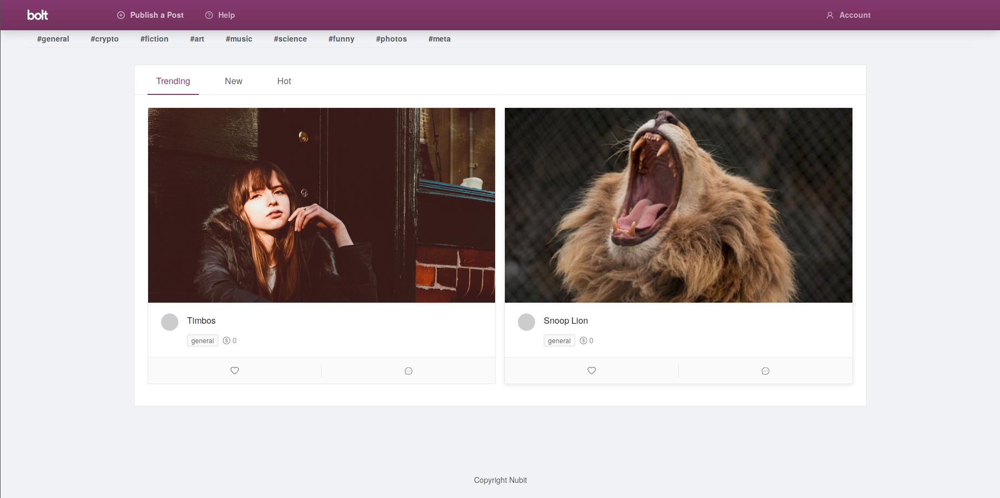
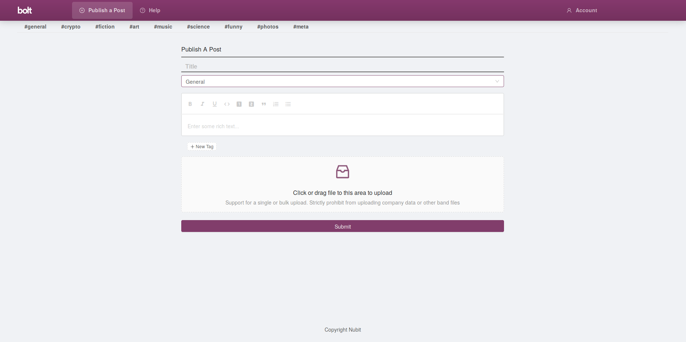
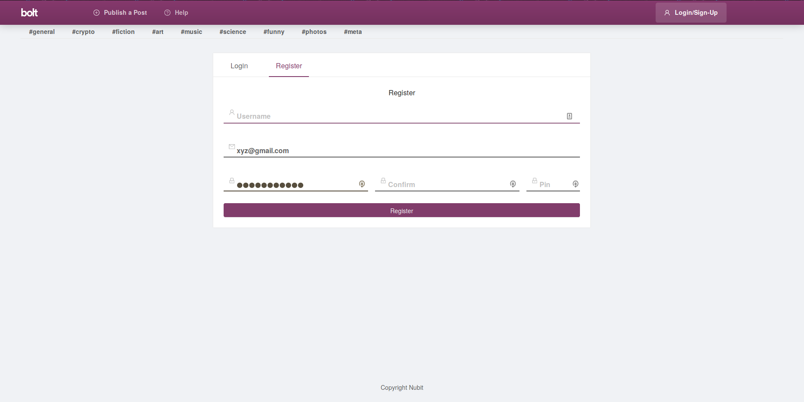

# Play Social Networking

For simplicity sake. To find further documents, look for create-react-app. 

To run, use the unix commands:

```
yarn install 
yarn install antd
yarn start
```

## Home Page



## Publish A Post


## Register Page

